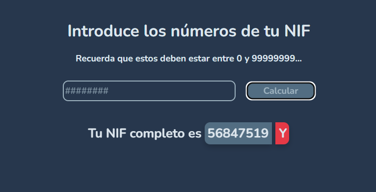

# Ejercicio 3: Script - Cálculo de NIF 

Este proyecto es una aplicación web sencilla que permite a los usuarios introducir un número de NIF (DNI) y obtener la letra correspondiente utilizando el algoritmo oficial.

Puedes acceder a la aplicación en el siguiente enlace:
[nif-calculator.aggiovato.com](https://nif-calculator.aggiovato.com)


## Tabla de Contenidos

1. [Descripción](#descripción)
2. [Estructura del Proyecto](#estructura-del-proyecto)
3. [Tecnologías Utilizadas](#tecnologías-utilizadas)
4. [Uso](#uso)

## Descripción

La aplicación toma un número de NIF (entre 0 y 99999999), lo procesa y devuelve la letra correspondiente al NIF completo. Si el número es inválido, muestra alertas apropiadas para guiar al usuario.

Además, la aplicación cuenta con una funcionalidad para copiar la letra resultante al portapapeles, con un pequeño icono que indica cuándo se ha copiado correctamente.

## Estructura del Proyecto

El proyecto está organizado en la siguiente estructura de archivos:

```plaintext
.
├── assets
│   └── logo_ej_3.svg        # Ícono de la aplicación
├── styles
│   └── style.css            # Archivo de estilos
├── scripts
│   ├── letters.js           # Array de objetos con la equivalencia número-letra
│   └── nif.js               # Lógica de cálculo del NIF
├── index.html               # Página principal de la aplicación
├── README.md                # Documentación del proyecto
```

## Tecnologías Utilizadas

- **HTML5**: Para la estructura de la aplicación.
- **CSS3**: Para el diseño y estilo, incluyendo el uso de la fuente _Nunito_ y un ícono personalizado.
- **JavaScript (ES6)**: Para la lógica del cálculo del NIF y la manipulación del DOM.
- **[Google Fonts](https://fonts.google.com/)**: Para importar la fuente _Nunito_.
- **[Font Awesome](https://fontawesome.com/)**: Para los íconos utilizados en la aplicación.
- **Git/GitHub**: Control de versiones y alojamiento del repositorio.

## Uso




1. **Introduce el NIF**:

   - En la página principal, verás un campo de entrada para el número de **NIF**.
   - El número debe estar entre **0** y **99999999**.

2. **Calcular la letra**:

   - Haz clic en el botón **"Calcular"** y la aplicación generará la **letra** correspondiente.
   - Si el número es inválido (más de **8 dígitos** o **negativo**), se mostrará una **alerta**.

3. **Copiar la letra**:
   - Puedes hacer clic sobre la **letra** para copiarla al portapapeles. Un pequeño **icono** indicará que se ha copiado correctamente.
